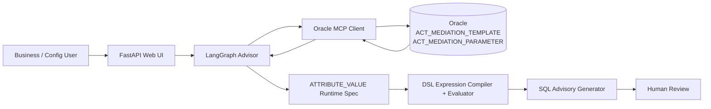
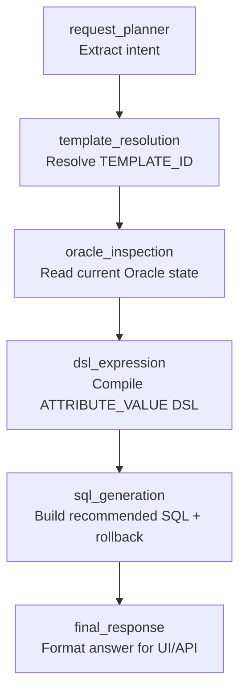
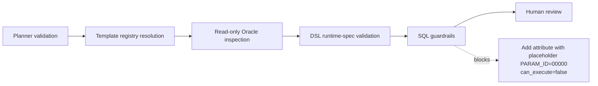

# Activiti Mediation Template SQL Advisor

AI-assisted SQL advisor for safely maintaining Activiti mediation template configuration in `ACT_MEDIATION_TEMPLATE` and `ACT_MEDIATION_PARAMETER`.

The tool converts a natural-language configuration request into a reviewed SQL advisory package: resolved template, Oracle inspection summary, compiled `ATTRIBUTE_VALUE` expression, recommended SQL, rollback SQL, warnings, and execution eligibility.

> **Important:** this application is an advisor. It does not execute DML against Oracle. SQL must be reviewed and executed manually by an authorized engineer or DBA.

---

## Why this project exists

Activiti mediation template changes are often risky because a small mistake in `ATTRIBUTE_NAME`, `ATTRIBUTE_VALUE`, template selection, or rollback handling can affect downstream product/order mediation behavior. This project makes that process safer by combining:

- natural-language request planning,
- deterministic template resolution,
- read-only Oracle inspection through MCP,
- rulebook-driven `ATTRIBUTE_VALUE` DSL compilation,
- evaluator/reflection validation,
- safe SQL and rollback generation.

---

## Core capabilities

- Understands supported requests:
  - rename an attribute,
  - add a new attribute,
  - update an `ATTRIBUTE_VALUE`,
  - append a sub-key inside a composite/container attribute such as `poAttributes`,
  - delete an attribute.
- Resolves configured templates using a local registry.
- Reads Oracle state before generating SQL.
- Preserves existing composite `ATTRIBUTE_VALUE` values when appending.
- Generates rollback SQL together with recommended SQL.
- Blocks unsafe insert execution when `PARAM_ID` is unknown.
- Uses an advisor-owned runtime spec for Activiti `ATTRIBUTE_VALUE` syntax.
- Uses a second-pass expression evaluator to catch incomplete DSL compilation, such as source-field lookup plus type conversion.

---

## High-level architecture



---

## LangGraph workflow



### Node responsibilities

| Node | Responsibility | LLM usage |
|---|---|---:|
| `request_planner` | Extract operation type, template phrase, attribute names, append key, RHS request | Yes |
| `template_resolution` | Match template using registry aliases and external system filters | No |
| `oracle_inspection` | Read template/parameter rows and check duplicates using Oracle MCP | No |
| `dsl_expression` | Compile the RHS into Activiti `ATTRIBUTE_VALUE` DSL and validate it | Deterministic first; LLM fallback/evaluator when needed |
| `sql_generation` | Generate SQL and rollback SQL with safety blocks | No |
| `final_response` | Format final markdown response | No |

---

## ATTRIBUTE_VALUE runtime model

The project separates two storage shapes.

### 1. Atomic ATTRIBUTE_VALUE row

Use when `ATTRIBUTE_NAME` itself is the target key.

```text
ATTRIBUTE_NAME  = ATTR_123
ATTRIBUTE_VALUE = VAL_123
```

Do **not** generate:

```text
ATTR_123=VAL_123;
```

because `ATTRIBUTE_NAME` already stores the row-level key.

### 2. Composite/container ATTRIBUTE_VALUE row

Use when the target attribute stores a packed set of semicolon-delimited key/value pairs, for example `poAttributes`.

```text
ATTRIBUTE_NAME  = poAttributes
ATTRIBUTE_VALUE = ccat_product_category=VAL_Consumer;CustomerType=VAL_123;
```

For append requests, the DSL node returns only the RHS expression and the SQL layer wraps it as:

```text
<append_key>=<compiled_expression>;
```

---

## DSL examples

| User request | Compiled expression |
|---|---|
| `add attribute ATTR_123 with value 123` | `VAL_123` |
| `add attribute ATTR_123 with dto field allowances.sms.freebies` | `allowances.sms.freebies` |
| `add attribute isActiveBoolean from dto field flags.isActive and convert it to BOOLEAN` | `$BOOL_flags.isActive` |
| `if subscriberType is PREPAID show 1 else 0` | `subscriberType#PREPAID\|1,ELSE\|0` |
| `add CustomerType with value 123 inside existing poAttributes` | `CustomerType=VAL_123;` as append fragment |

---

## Safety model



Key guardrails:

- Oracle is inspected before SQL generation.
- Existing `ATTRIBUTE_VALUE` is preserved for composite append.
- Rollback SQL is generated with each recommendation.
- `add_attribute` SQL is draft-only because the system must not guess real `PARAM_ID` values.
- The app returns `can_execute=false` for draft/unsafe SQL.
- The app does not execute SQL.

---

## Project structure

```text
.
├── data/
│   ├── expression_rules/
│   │   └── attribute_value_runtime_spec.json
│   └── template_registry/
│       └── template_registry.yaml
├── src/
│   └── activiti_mediation_template_sql_advisor/
│       ├── graph/
│       │   ├── builder.py
│       │   ├── state.py
│       │   └── nodes/
│       │       ├── request_planner.py
│       │       ├── template_resolution.py
│       │       ├── oracle_inspection.py
│       │       ├── dsl_expression.py
│       │       ├── sql_generation.py
│       │       └── final_response.py
│       ├── dsl_rules/
│       │   └── attribute_value_rulebook.py
│       ├── mcp_client/
│       │   └── oracle_mcp_client.py
│       └── web_app.py
├── pyproject.toml
└── README.md
```

---

## Requirements

- Python 3.11
- `uv`
- OpenAI API key for planner and fallback/evaluator calls
- Oracle MCP server/client configuration for read-only inspection

Core Python dependencies include FastAPI, LangGraph, OpenAI, MCP, OracleDB, Pydantic, PyYAML, and Uvicorn.

---

## Setup

```powershell
uv sync
```

Create a `.env` file:

```env
OPENAI_API_KEY=your_key_here
OPENAI_MODEL=gpt-4.1-nano
```

Add any Oracle MCP environment/configuration required by your local MCP server.

---

## Run compile check

```powershell
uv run python -m compileall src
```

---

## Run the web app

```powershell
uv run uvicorn activiti_mediation_template_sql_advisor.web_app:app --reload --port 8000
```

Open:

```text
http://127.0.0.1:8000
```

---

## Run from terminal

```powershell
uv run python -c "import asyncio; from activiti_mediation_template_sql_advisor.graph.builder import run_advisor; result = asyncio.run(run_advisor('For prepaid base plan rtf template, add a new attribute ATTR_123 with value 123')); print(result.get('final_answer', ''))"
```

---

## Demo prompts

### 1. Add literal attribute

```text
For prepaid base plan rtf template, add a new attribute ATTR_123 with value 123
```

Expected DSL:

```text
VAL_123
```

Expected safety behavior:

```text
Draft INSERT only, PARAM_ID=00000, can_execute=false
```

### 2. Add DTO/source-field attribute

```text
For prepaid base plan rtf template, add a new attribute ATTR_123 with dto field allowances.sms.freebies
```

Expected DSL:

```text
allowances.sms.freebies
```

### 3. Source field + Boolean conversion

```text
For prepaid base plan rtf template, add a new attribute isActiveBoolean from dto field flags.isActive and convert it to BOOLEAN
```

Expected DSL:

```text
$BOOL_flags.isActive
```

### 4. Append mapping into `poAttributes`

```text
For Prepaid Base Plan ECM request, add CustomerType with value if subscriberType is PREPAID show 1 else 0 inside existing poAttributes.
```

Expected append fragment:

```text
CustomerType=subscriberType#PREPAID|1,ELSE|0;
```

Expected SQL behavior:

```text
Preserve existing full poAttributes value, append only the new segment, generate rollback SQL.
```

---

## What makes this safer than direct LLM SQL generation

The LLM does not directly execute SQL. It also does not blindly generate final SQL from scratch.

Instead:

1. The planner extracts intent.
2. Deterministic code resolves templates and inspects Oracle.
3. The DSL compiler uses an internal runtime spec.
4. The evaluator checks whether the compiled expression fully matches the request.
5. Python safety guards block dangerous/invalid output.
6. SQL generation is deterministic.
7. Final output is advisory only.

---

## Roadmap

- Add more deterministic registry rules for all common runtime spec prefixes.
- Add automated unit tests for each `ATTRIBUTE_VALUE` expression category.
- Add optional approval workflow before exposing executable SQL.
- Add audit log export for each advisor run.
- Add template registry management UI.
- Add comparison mode: current value vs proposed value.

---

## Disclaimer

This project produces SQL advisory output only. It does not replace engineering/DBA review, change management, or production deployment approval.
